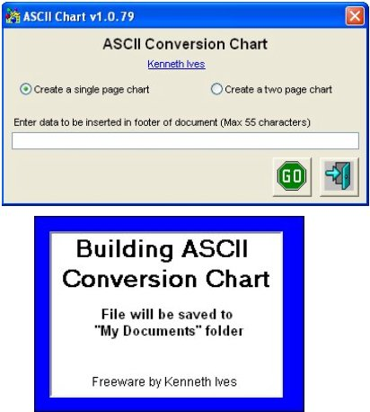



## ASCII Chart in Word 2k  15\-Jun\-2012

### Description

Example of creating either one or two page ASCII conversion chart and displaying it in Word 2000. If you want to use a newer version then you may have to do some tweaking.

----

15-Jun-2012 Updated documentation and support modules.
 
### More Info
 

             |
---                |---
**Submitted On**   |2012-06-14 18:38:00
**By**             |[Kenaso](https://github.com/Planet-Source-Code/PSCIndex/blob/master/ByAuthor/kenaso.md)
**Level**          |Intermediate
**User Rating**    |5.0 (15 globes from 3 users)
**Compatibility**  |VB 6\.0
**Category**       |[Complete Applications](https://github.com/Planet-Source-Code/PSCIndex/blob/master/ByCategory/complete-applications__1-27.md)
**World**          |[Visual Basic](https://github.com/Planet-Source-Code/PSCIndex/blob/master/ByWorld/visual-basic.md)
**Archive File**   |[ASCII\_Char2224996152012\.zip](https://github.com/Planet-Source-Code/kenaso-ascii-chart-in-word-2k-15-jun-2012__1-73478/archive/master.zip)

